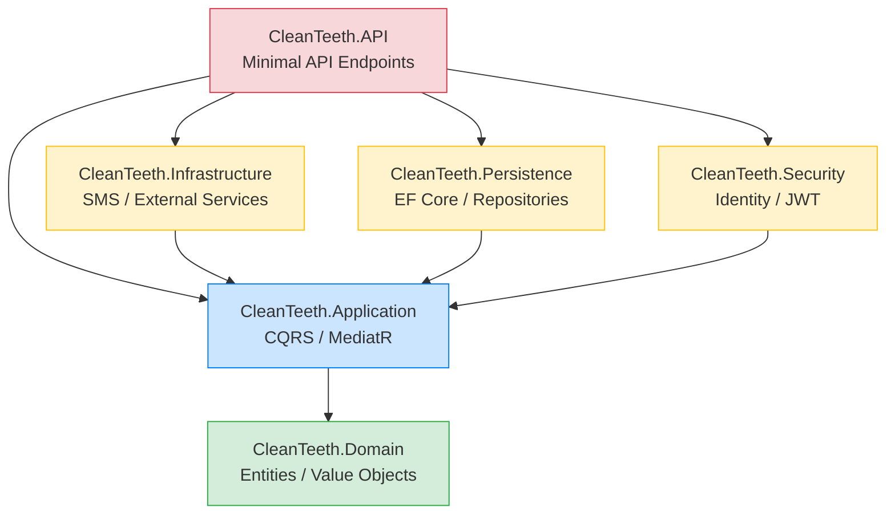
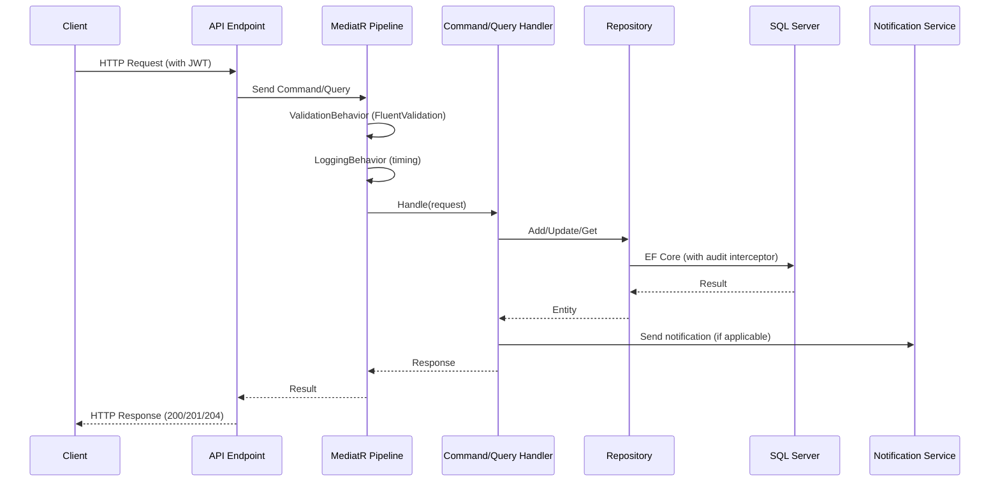

# CleanTeeth — Dental Clinic Management System

A modern, production-ready backend for managing dental clinics, built with **.NET 9** and **Clean Architecture**. The system handles patient/dentist profiles, dental offices, appointment scheduling with conflict detection, treatment records, role-based access control, and automated SMS notifications.

---

##  Architecture

The solution follows **Clean Architecture** combined with **Vertical Slice** organization in the Application layer. Dependencies point strictly inward — the Domain layer has zero external dependencies, the Application layer depends only on Domain, and all infrastructure concerns (EF Core, Identity, SMS) are isolated in outer layers.

### Layer Dependency Diagram



### Request Flow



### Project Structure

```
CleanTeeth.sln
├── CleanTeeth.Domain          ← Enterprise business rules (no dependencies)
│   ├── Entities              Patient, Dentist, DentalOffice, Appointment, Treatment
│   ├── ValueObjects          PhoneNumber, Email, TimeInterval (immutable records)
│   ├── Enums                 AppointmentStatus, DentistStatus, TreatmentStatus, Gender
│   ├── Exceptions            BusinessRuleException
│   └── Common                AuditableEntity, ISoftDeletable, AuditLog
│
├── CleanTeeth.Application     ← Application business rules (CQRS via MediatR)
│   ├── Features/             Vertical slices per resource
│   │   ├── Commands/         Create/Update/Delete/StatusChange (Command + Handler + Validator)
│   │   └── Queries/          GetList/GetDetail (Query + Handler + Response + Validator)
│   ├── Behaviors/            LoggingBehavior, ValidationBehavior (MediatR pipeline)
│   ├── Contracts/            Repository interfaces, IUnitOfWork, IUserService
│   └── Notifications/        INotifications (SMS abstraction) + DTOs
│
├── CleanTeeth.Infrastructure  ← External service implementations
│   └── Notifications/        MessageService (simulated SMS provider)
│
├── CleanTeeth.Persistence     ← EF Core data access
│   ├── CleanTeethDbContext   Auto-audit fields, soft-delete global query filters
│   ├── Interceptors/         AuditSaveChangesInterceptor (full change audit log)
│   ├── Repositories/         Generic + feature-specific repositories with role-based filtering
│   ├── Configurations/       EF Core entity type configurations
│   └── Migrations/
│
├── CleanTeeth.Security        ← Identity & authentication
│   ├── CleanTeethSecurityDbContext (ASP.NET Core Identity)
│   ├── TokenService          JWT generation & validation
│   ├── UserService           Current user context (sub claim, role checks)
│   └── SecuritySeeder        Role + admin account seeding at startup
│
├── CleanTeeth.API             ← Minimal API presentation layer
│   ├── Endpoints/            Resource-based endpoints (auto-discovered via reflection)
│   ├── Dtos/                 Request DTOs with FluentValidation
│   ├── ExceptionHandling/    GlobalExceptionHandler → RFC 7807 ProblemDetails
│   └── Infrastructure/       Endpoint auto-registration
│
└── CleanTeeth.Tests           ← Unit tests
    ├── Domain/               Entity & Value Object business rule tests
    └── Application/          Command/Query handlers, Validators, AutoMapper profiles
```

---

##  Tech Stack

| Category | Technology |
|----------|------------|
| Runtime | **.NET 9** (net9.0) |
| Web Framework | **ASP.NET Core Minimal API** |
| ORM | **Entity Framework Core 9** + SQL Server |
| CQRS / Mediator | **MediatR 14** |
| Validation | **FluentValidation 12** (API + Application layers) |
| Mapping | **AutoMapper 16** |
| Authentication | **ASP.NET Core Identity** + **JWT Bearer** |
| Logging | **Serilog** (Console + rolling JSON file) |
| API Docs | **Scalar** (OpenAPI) |
| Testing | **MSTest**, **NSubstitute**, **FluentAssertions** |
| Test DB | **EF Core SQLite** (in-memory) |

---

##  Business Features

### 1. User Registration & Authentication
- **Patient registration** — creates an Identity user, assigns the `Patient` role, and creates the patient profile in a single transaction. If profile creation fails, the user account is rolled back.
- **Dentist registration** — same pattern with the `Dentist` role.
- **Login** — email/password authentication with JWT token issuance (8-hour expiration). Account lockout after 5 failed attempts (15 minutes).
- **Me endpoint** — returns the current authenticated user's ID, email, and roles.

### 2. Patient Management
- Patient profile with name, date of birth, gender, phone, email, address.
- Auto-generated unique patient number.
- Patients can update their own profile; Admin can delete (soft delete).

### 3. Dentist Management
- Dentist profile with name, gender, phone, email, license number, specialty.
- **Status lifecycle**: `Active` → `Inactive` / `OnLeave` (Admin-controlled).
- Dentists can update their own profile; Admin can delete or change status.

### 4. Dental Office Management
- Clinic locations with name, address, phone, email.
- CRUD operations available to Dentists and Admin.

### 5. Appointment Scheduling
- Patients book appointments by selecting a dentist and dental office within a time interval.
- **Conflict detection**: the system checks for overlapping bookings for the same patient, dentist, **or** dental office — preventing double-booking at any level.
- **Status lifecycle**: `Scheduled` → `Completed` (by dentist) or `Cancelled` (by patient or dentist).
- **SMS confirmation**: a confirmation SMS is sent to the patient immediately after successful booking.

### 6. Treatment & Diagnosis
- Dentists start a `Treatment` linked to a scheduled appointment (status: `InProgress`).
- **Completion**: the dentist records diagnosis notes; the system calculates treatment duration and sets status to `Completed`.
- **Cancellation**: in-progress treatments can be cancelled.
- **Treatment report SMS**: after successful completion, a report SMS (clinic, dentist, completion time, duration, diagnosis notes) is sent to the patient.

### 7. SMS Notifications
Abstracted via `INotifications` interface with a simulated `MessageService` that logs SMS content (800ms latency). Supports:
- **Appointment confirmation** — patient, dentist, clinic, scheduled time.
- **Treatment report** — clinic, dentist, completion time, duration, diagnosis notes.

Swapping in a real SMS provider (e.g., Twilio, MessageBird) requires only implementing `INotifications`.

---

##  API Endpoints

All endpoints return JSON. Errors follow RFC 7807 `ProblemDetails`.

### Auth

| Method | Endpoint | Auth | Description |
|--------|----------|------|-------------|
| POST | `/api/auth/register/patient` | Public | Register a patient account + profile |
| POST | `/api/auth/register/dentist` | Public | Register a dentist account + profile |
| POST | `/api/auth/login` | Public | Login, returns JWT access token |
| GET | `/api/auth/me` | Authenticated | Get current user info (ID, email, roles) |

### Appointments

| Method | Endpoint | Auth Policy | Description |
|--------|----------|-------------|-------------|
| POST | `/api/appointment` | Patient | Create a new appointment |
| GET | `/api/appointment` | Authenticated | Get paged appointment list (role-filtered) |
| GET | `/api/appointment/{id}` | Authenticated | Get appointment details |
| POST | `/api/appointment/{id}/cancel` | PatientOrDentist | Cancel an appointment |
| POST | `/api/appointment/{id}/complete` | Dentist | Mark appointment as completed |

### Treatments

| Method | Endpoint | Auth Policy | Description |
|--------|----------|-------------|-------------|
| POST | `/api/treatment` | Dentist | Start a new treatment for an appointment |
| POST | `/api/treatment/{id}/complete` | Dentist | Complete treatment with diagnosis notes |
| POST | `/api/treatment/{id}/cancel` | Dentist | Cancel an in-progress treatment |
| GET | `/api/treatments` | Authenticated | Get paged treatment list (role-filtered) |
| GET | `/api/treatment/{id}` | Authenticated | Get treatment details |

### Patients

| Method | Endpoint | Auth Policy | Description |
|--------|----------|-------------|-------------|
| GET | `/api/patient` | Authenticated | Get paged patient list |
| GET | `/api/patient/{id}` | Authenticated | Get patient details |
| PUT | `/api/patient/{id}` | Patient | Update patient profile |
| DELETE | `/api/patient/{id}` | Admin | Soft-delete a patient |

### Dentists

| Method | Endpoint | Auth Policy | Description |
|--------|----------|-------------|-------------|
| GET | `/api/dentist` | Authenticated | Get paged dentist list |
| GET | `/api/dentist/{id}` | Authenticated | Get dentist details |
| PUT | `/api/dentist/{id}` | Dentist | Update dentist profile |
| DELETE | `/api/dentist/{id}` | Admin | Soft-delete a dentist |
| POST | `/api/dentist/{id}/active` | Admin | Set dentist status to Active |
| POST | `/api/dentist/{id}/inactive` | Admin | Set dentist status to Inactive |
| POST | `/api/dentist/{id}/onleave` | Admin | Set dentist status to OnLeave |

### Dental Offices

| Method | Endpoint | Auth Policy | Description |
|--------|----------|-------------|-------------|
| POST | `/api/dentaloffices` | Dentist | Create a new dental office |
| GET | `/api/dentaloffices` | Authenticated | List all dental offices |
| GET | `/api/dentaloffices/{id}` | Authenticated | Get dental office details |
| PUT | `/api/dentaloffices/{id}` | Dentist | Update a dental office |
| DELETE | `/api/dentaloffices/{id}` | Dentist | Delete a dental office |

### Authorization Policies

| Policy | Allowed Roles | Use Case |
|--------|---------------|----------|
| `Admin` | Admin | Delete operations, dentist status changes |
| `Dentist` | Dentist, Admin | Treatment/appointment management, dental office CRUD |
| `Patient` | Patient, Admin | Self-profile updates, appointment booking |
| `PatientOrDentist` | Patient, Dentist, Admin | Appointment cancellation |

---

##  Security Considerations

- **JWT authentication** with issuer, audience, and signing-key validation (1-minute clock skew).
- **Role-based access control** with four policies; resource-level row filtering in repositories.
- **IDOR prevention**: `PatientId` in appointment creation is derived from the JWT `sub` claim, never accepted from the client.
- **Information hiding**: unauthorized access to a specific record returns **404 Not Found** (not 403 Forbidden).
- **Data isolation**: dentists see only their own appointments/treatments; patients see only their own.
- **Audit trail**: every entity mutation is logged (Created/Updated/Deleted) with old/new values and the acting user.
- **Soft delete**: deleted entities are excluded from all queries by default.
- **Secrets management**: connection strings, JWT keys, and admin credentials stored in User Secrets (not `appsettings.json`).

---

##  Testing

- **Frameworks**: MSTest + NSubstitute (mocking) + FluentAssertions.
- **Coverage**: Domain entities, value objects, all CQRS handlers, validators, and AutoMapper profiles.
- **Application layer coverage: ~91%**.

```powershell
# Run all tests
dotnet test CleanTeeth.Tests/CleanTeeth.Tests.csproj

# Run tests for a specific feature
dotnet test CleanTeeth.Tests/CleanTeeth.Tests.csproj --filter "CompleteTreatment"
```

---

##  Getting Started

### Prerequisites
- .NET 9 SDK
- SQL Server (or SQL Server Express)

### Configuration (User Secrets)

```powershell
dotnet user-secrets init --project CleanTeeth.API
dotnet user-secrets set "ConnectionStrings:CleanTeethConnectionString" "Server=...;Database=CleanTeethDB;User Id=sa;Password=...;TrustServerCertificate=true;" --project CleanTeeth.API
dotnet user-secrets set "Jwt:SigningKey" "your-256-bit-secret-key" --project CleanTeeth.API
dotnet user-secrets set "Admin:Email" "admin@cleanteeth.de" --project CleanTeeth.API
dotnet user-secrets set "Admin:Password" "YourSecurePassword123!" --project CleanTeeth.API
```

### Run

```powershell
# Apply database migrations
dotnet ef database update --project CleanTeeth.Persistence --startup-project CleanTeeth.API

# Run the API
dotnet run --project CleanTeeth.API
```

API documentation (Scalar UI) is available at `/scalar` in development mode.

---

##  Design Principles

- **Dependency Inversion**: Application depends on abstractions; implementations live in outer layers.
- **CQRS**: Write (Commands) and read (Queries) models are separated.
- **Vertical Slice**: features are self-contained, reducing coupling.
- **Fail Fast**: validation at the API boundary and again in the MediatR pipeline.
- **CancellationToken propagation**: full async chain supports cancellation.
- **Exceptions are not control flow**: business rule violations are explicit domain exceptions, not try/catch logic.
