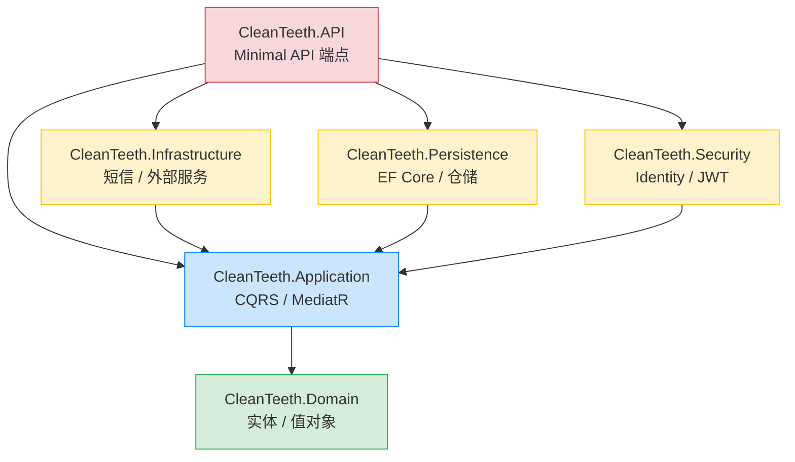
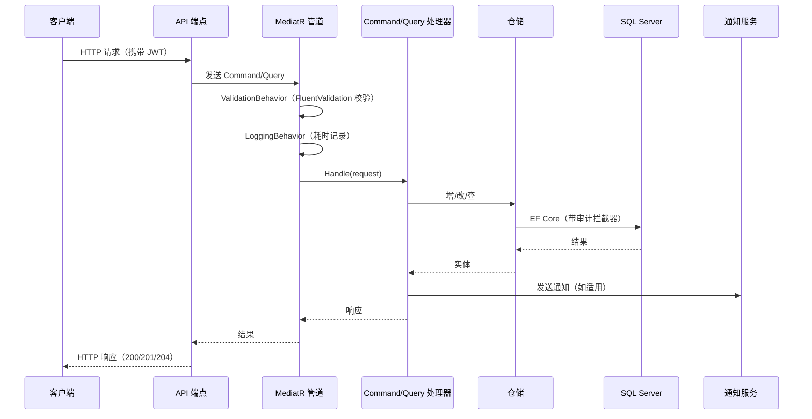

# CleanTeeth — 牙科诊所管理系统

一个基于 **.NET 9** 和 **Clean Architecture（清洁架构）** 的现代化、生产级牙科诊所管理后端。系统涵盖患者/医生档案管理、诊所管理、带冲突检测的预约排程、诊疗记录、基于角色的访问控制以及自动化短信通知。

---

##  架构

本项目采用 **Clean Architecture（清洁架构）**，并在 Application 层使用 **Vertical Slice（垂直切片）** 组织代码。依赖方向严格向内——Domain 层零外部依赖，Application 层仅依赖 Domain，所有基础设施关注点（EF Core、Identity、短信）隔离在外部层。

### 分层依赖图



### 请求处理流程



### 项目结构

```
CleanTeeth.sln
├── CleanTeeth.Domain          ← 企业业务规则（无任何依赖）
│   ├── Entities              Patient, Dentist, DentalOffice, Appointment, Treatment
│   ├── ValueObjects          PhoneNumber, Email, TimeInterval（不可变 record）
│   ├── Enums                 AppointmentStatus, DentistStatus, TreatmentStatus, Gender
│   ├── Exceptions            BusinessRuleException
│   └── Common                AuditableEntity, ISoftDeletable, AuditLog
│
├── CleanTeeth.Application     ← 应用业务规则（基于 MediatR 的 CQRS）
│   ├── Features/             按资源垂直切片
│   │   ├── Commands/         创建/更新/删除/状态变更（Command + Handler + Validator）
│   │   └── Queries/          列表/详情查询（Query + Handler + Response + Validator）
│   ├── Behaviors/            LoggingBehavior, ValidationBehavior（MediatR 管道）
│   ├── Contracts/            仓储接口、IUnitOfWork、IUserService
│   └── Notifications/        INotifications（短信抽象）+ DTO
│
├── CleanTeeth.Infrastructure  ← 外部服务实现
│   └── Notifications/        MessageService（模拟短信服务商）
│
├── CleanTeeth.Persistence     ← EF Core 数据访问
│   ├── CleanTeethDbContext   自动审计字段、软删除全局查询过滤器
│   ├── Interceptors/         AuditSaveChangesInterceptor（完整变更审计日志）
│   ├── Repositories/         泛型 + 特性仓储（带基于角色的数据过滤）
│   ├── Configurations/       EF Core 实体类型配置
│   └── Migrations/
│
├── CleanTeeth.Security        ← 身份认证与授权
│   ├── CleanTeethSecurityDbContext（ASP.NET Core Identity）
│   ├── TokenService          JWT 生成与校验
│   ├── UserService           当前用户上下文（sub 声明、角色检查）
│   └── SecuritySeeder        启动时自动播种角色和管理员账号
│
├── CleanTeeth.API             ← Minimal API 表现层
│   ├── Endpoints/            按资源组织的端点（反射自动注册）
│   ├── Dtos/                 请求 DTO（带 FluentValidation 校验）
│   ├── ExceptionHandling/    全局异常处理器 → RFC 7807 ProblemDetails
│   └── Infrastructure/       端点自动注册
│
└── CleanTeeth.Tests           ← 单元测试
    ├── Domain/               实体与值对象业务规则测试
    └── Application/          Command/Query 处理器、校验器、AutoMapper 配置
```

---

##  技术栈

| 分类 | 技术 |
|------|------|
| 运行时 | **.NET 9** (net9.0) |
| Web 框架 | **ASP.NET Core Minimal API** |
| ORM | **Entity Framework Core 9** + SQL Server |
| CQRS / 中介者 | **MediatR 14** |
| 校验 | **FluentValidation 12**（API + Application 双层） |
| 对象映射 | **AutoMapper 16** |
| 认证 | **ASP.NET Core Identity** + **JWT Bearer** |
| 日志 | **Serilog**（控制台 + 滚动 JSON 文件） |
| API 文档 | **Scalar**（OpenAPI） |
| 测试 | **MSTest**, **NSubstitute**, **FluentAssertions** |
| 测试数据库 | **EF Core SQLite**（内存模式） |

---

##  业务功能

### 1. 用户注册与认证
- **患者注册** — 创建 Identity 用户、分配 `Patient` 角色、创建患者档案，三者在同一事务中完成。若档案创建失败，用户账号自动回滚。
- **医生注册** — 同上模式，分配 `Dentist` 角色。
- **登录** — 邮箱/密码认证，签发 JWT（有效期 8 小时）。连续 5 次失败锁定账号 15 分钟。
- **当前用户接口** — 返回已认证用户的 ID、邮箱和角色。

### 2. 患者管理
- 患者档案包含姓名、出生日期、性别、电话、邮箱、地址。
- 自动生成唯一患者编号。
- 患者可更新自己的档案；管理员可删除（软删除）。

### 3. 医生管理
- 医生档案包含姓名、性别、电话、邮箱、执业证号、专长。
- **状态生命周期**：`Active（在岗）` → `Inactive（停用）` / `OnLeave（休假）`（由管理员控制）。
- 医生可更新自己的档案；管理员可删除或变更状态。

### 4. 诊所管理
- 诊所地点信息：名称、地址、电话、邮箱。
- 医生和管理员可执行增删改查。

### 5. 预约排程
- 患者选择医生和诊所，在指定时间段内创建预约。
- **冲突检测**：系统检查同一患者、同一医生或同一诊所在请求时间段内是否已有预约，从任意维度防止双重预订。
- **状态生命周期**：`Scheduled（已预约）` → `Completed（已完成）`（医生操作）或 `Cancelled（已取消）`（患者或医生操作）。
- **短信确认**：预约成功后立即向患者发送确认短信。

### 6. 诊疗与诊断
- 医生为已预约的患者创建 `Treatment`（状态：`InProgress 进行中`）。
- **完成诊疗**：医生记录诊断备注，系统自动计算诊疗时长并将状态设为 `Completed 已完成`。
- **取消诊疗**：进行中的诊疗可被取消。
- **诊疗报告短信**：诊疗完成后，向患者发送报告短信（诊所、医生、完成时间、时长、诊断备注）。

### 7. 短信通知
通过 `INotifications` 接口抽象，当前由 `MessageService` 模拟实现（记录日志，800ms 延迟）。支持：
- **预约确认** — 患者、医生、诊所、预约时间。
- **诊疗报告** — 诊所、医生、完成时间、时长、诊断备注。

接入真实短信服务商（如 Twilio、MessageBird）只需实现 `INotifications` 接口。

---

##  API 端点

所有端点返回 JSON，错误遵循 RFC 7807 `ProblemDetails` 规范。

### 认证 Auth

| 方法 | 端点 | 鉴权 | 说明 |
|------|------|------|------|
| POST | `/api/auth/register/patient` | 公开 | 注册患者账号及档案 |
| POST | `/api/auth/register/dentist` | 公开 | 注册医生账号及档案 |
| POST | `/api/auth/login` | 公开 | 登录，返回 JWT 令牌 |
| GET | `/api/auth/me` | 已认证 | 获取当前用户信息（ID、邮箱、角色） |

### 预约 Appointments

| 方法 | 端点 | 鉴权策略 | 说明 |
|------|------|----------|------|
| POST | `/api/appointment` | Patient | 创建预约 |
| GET | `/api/appointment` | 已认证 | 获取预约列表（分页，按角色过滤） |
| GET | `/api/appointment/{id}` | 已认证 | 获取预约详情 |
| POST | `/api/appointment/{id}/cancel` | PatientOrDentist | 取消预约 |
| POST | `/api/appointment/{id}/complete` | Dentist | 标记预约已完成 |

### 诊疗 Treatments

| 方法 | 端点 | 鉴权策略 | 说明 |
|------|------|----------|------|
| POST | `/api/treatment` | Dentist | 为预约创建诊疗记录 |
| POST | `/api/treatment/{id}/complete` | Dentist | 完成诊疗并记录诊断 |
| POST | `/api/treatment/{id}/cancel` | Dentist | 取消进行中的诊疗 |
| GET | `/api/treatments` | 已认证 | 获取诊疗列表（分页，按角色过滤） |
| GET | `/api/treatment/{id}` | 已认证 | 获取诊疗详情 |

### 患者 Patients

| 方法 | 端点 | 鉴权策略 | 说明 |
|------|------|----------|------|
| GET | `/api/patient` | 已认证 | 获取患者列表（分页） |
| GET | `/api/patient/{id}` | 已认证 | 获取患者详情 |
| PUT | `/api/patient/{id}` | Patient | 更新患者档案 |
| DELETE | `/api/patient/{id}` | Admin | 软删除患者 |

### 医生 Dentists

| 方法 | 端点 | 鉴权策略 | 说明 |
|------|------|----------|------|
| GET | `/api/dentist` | 已认证 | 获取医生列表（分页） |
| GET | `/api/dentist/{id}` | 已认证 | 获取医生详情 |
| PUT | `/api/dentist/{id}` | Dentist | 更新医生档案 |
| DELETE | `/api/dentist/{id}` | Admin | 软删除医生 |
| POST | `/api/dentist/{id}/active` | Admin | 设置医生状态为在岗 |
| POST | `/api/dentist/{id}/inactive` | Admin | 设置医生状态为停用 |
| POST | `/api/dentist/{id}/onleave` | Admin | 设置医生状态为休假 |

### 诊所 Dental Offices

| 方法 | 端点 | 鉴权策略 | 说明 |
|------|------|----------|------|
| POST | `/api/dentaloffices` | Dentist | 创建诊所 |
| GET | `/api/dentaloffices` | 已认证 | 获取所有诊所列表 |
| GET | `/api/dentaloffices/{id}` | 已认证 | 获取诊所详情 |
| PUT | `/api/dentaloffices/{id}` | Dentist | 更新诊所 |
| DELETE | `/api/dentaloffices/{id}` | Dentist | 删除诊所 |

### 授权策略说明

| 策略 | 允许角色 | 典型用途 |
|------|----------|----------|
| `Admin` | Admin | 删除操作、医生状态变更 |
| `Dentist` | Dentist, Admin | 诊疗/预约管理、诊所增删改 |
| `Patient` | Patient, Admin | 个人档案更新、预约创建 |
| `PatientOrDentist` | Patient, Dentist, Admin | 预约取消 |

---

##  安全要点

- **JWT 认证**：校验签发者、受众、签名密钥（时钟偏移 1 分钟）。
- **基于角色的访问控制**：四套授权策略，仓储层实现行级数据过滤。
- **IDOR 防护**：创建预约时的 `PatientId` 从 JWT `sub` 声明获取，不接受客户端传入。
- **信息隐藏**：越权访问具体记录返回 **404 Not Found**（而非 403），避免资源存在性泄露。
- **数据隔离**：医生仅能查看自己的预约/诊疗，患者仅能查看自己的。
- **审计追踪**：每次实体变更（创建/更新/删除）都记录变更前后值及操作人。
- **软删除**：已删除实体默认从所有查询中排除。
- **密钥管理**：连接字符串、JWT 密钥、管理员凭证均存储于 User Secrets，不写入配置文件。

---

##  测试

- **测试框架**：MSTest + NSubstitute（Mock）+ FluentAssertions。
- **覆盖范围**：领域实体、值对象、所有 CQRS 处理器、校验器、AutoMapper 配置。
- **Application 层覆盖率：约 91%**。

```powershell
# 运行所有测试
dotnet test CleanTeeth.Tests/CleanTeeth.Tests.csproj

# 运行特定功能的测试
dotnet test CleanTeeth.Tests/CleanTeeth.Tests.csproj --filter "CompleteTreatment"
```

---

##  快速开始

### 环境要求
- .NET 9 SDK
- SQL Server（或 SQL Server Express）

### 配置（User Secrets）

```powershell
dotnet user-secrets init --project CleanTeeth.API
dotnet user-secrets set "ConnectionStrings:CleanTeethConnectionString" "Server=...;Database=CleanTeethDB;User Id=sa;Password=...;TrustServerCertificate=true;" --project CleanTeeth.API
dotnet user-secrets set "Jwt:SigningKey" "your-256-bit-secret-key" --project CleanTeeth.API
dotnet user-secrets set "Admin:Email" "admin@cleanteeth.de" --project CleanTeeth.API
dotnet user-secrets set "Admin:Password" "YourSecurePassword123!" --project CleanTeeth.API
```

### 运行

```powershell
# 应用数据库迁移
dotnet ef database update --project CleanTeeth.Persistence --startup-project CleanTeeth.API

# 运行 API
dotnet run --project CleanTeeth.API
```

开发环境下访问 `/scalar` 查看 API 文档。

---

##  设计原则

- **依赖倒置**：Application 层依赖抽象，实现在外部层。
- **CQRS**：写（Command）和读（Query）模型分离。
- **垂直切片**：每个功能自包含，降低耦合。
- **快速失败**：API 边界和 MediatR 管道双重校验。
- **CancellationToken 全链路传递**：从 HTTP 端点到 EF Core 查询全程支持取消。
- **异常不用作控制流**：业务规则违规是显式的领域异常，而非 try/catch 逻辑。
